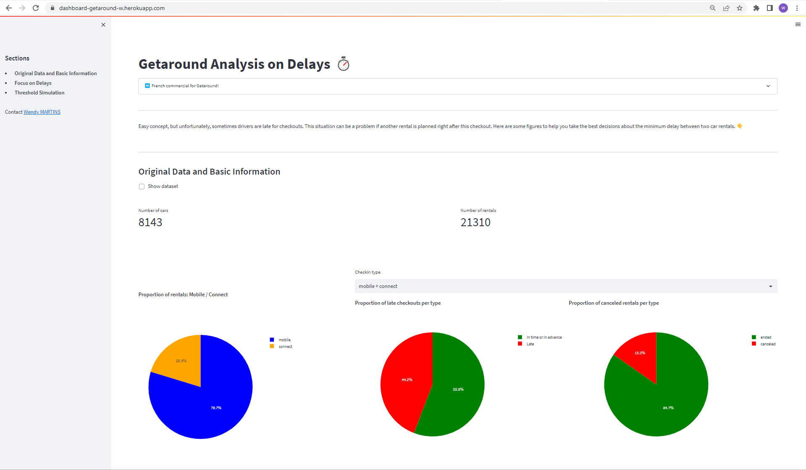
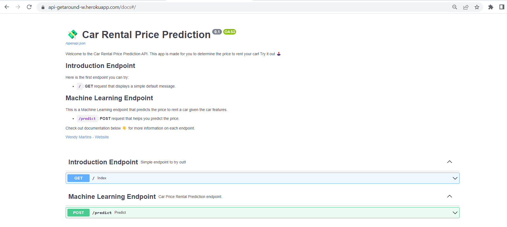

  

## Company

[GetAround](https://fr.getaround.com/) is the Airbnb for cars. You can rent cars from any person for a few hours to a few days! Founded in 2009, this company has known rapid growth. In 2019, they count over 5 million users and about 20K available cars worldwide. 

## Project

When using Getaround, drivers book cars for a specific time period, from an hour to a few days long. They are supposed to bring back the car on time, but it happens from time to time that drivers are late for the checkout.

Late returns at checkout can generate high friction for the next driver if the car was supposed to be rented again on the same day. Customer service often reports users unsatisfied because they had to wait for the car to come back from the previous rental or users that even had to cancel their rental because the car wasn’t returned on time.

## Our Goal

**Create an API, using a Machine Learning Model, to help users determine the price they can rent their car**

<ins>Folders:</ins> 1-mlflow , 2-machine-learning , 3-api

<ins>Tools:</ins> Python (sklearn, FastAPI), Docker, MLFlow, Heroku      
 

**Create a dashboard in order to help the Marketing Team to decide which treshold should be implemented between 2 rentals of the same car**

<ins>Folders:</ins> 4-streamlit

<ins> Tools:</ins> Python (Streamlit), Heroku
 
 

> Video link to understand the code (FR) :  VIDYARD

 
 

> Dashboard made with Streamlit

 
 

> API made with FastAPI
